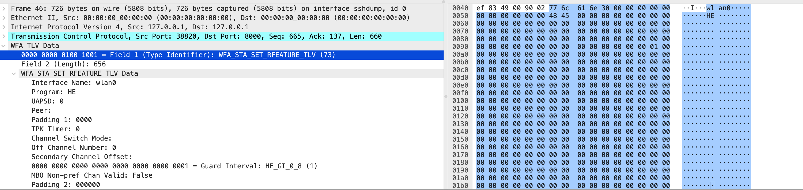

# Wireshark Lua Dissector for WFA Control Agent TLV Protocol

[](LICENSE)

This repository contains a Wireshark Lua dissector for the WFA Control Agent TLV Protocol. The dissector is designed to parse TLV-formatted packets transmitted over TCP on port 8000, particularly for fields such as `WFA_STA_SET_RFEATURE_TLV` and `WFA_STA_DISCONNECT_TLV`.



## Features

- **Flexible Protocol Parsing:** Supports multiple TLV formats based on `Field 1` value.
- **Detailed Field Analysis:** Parses fields such as `Interface Name`, `Program`, `UAPSD`, and `Guard Interval` with precision.
- **Scalable Design:** Easily extendable to support additional TLV formats in the future.

## Installation

### Prerequisites

- **Wireshark:** Ensure Wireshark is installed on your system. You can download it from [here](https://www.wireshark.org/).
- **Lua 5.2 or later:** Wireshark's Lua support requires Lua version 5.2 or later.

### Steps

1. **Clone the Repository:**

    ```sh
    git clone https://github.com/chinawrj/wfa_ca_tlv_protol_dissector.git
    ``` 

2. **Copy the Lua Script:**

    Copy the `wfa.lua` script to your Wireshark plugins directory. The typical location is: 

    - **Windows:** `C:\Program Files\Wireshark\plugins\`
    - **macOS:** `/Applications/Wireshark.app/Contents/Resources/share/wireshark/plugins/`
    - **Linux:** `/usr/lib/x86_64-linux-gnu/wireshark/plugins/`

    Alternatively, you can place the script in your Wireshark profile directory, typically found in `~/.config/wireshark/plugins/`.

3. **Verify Installation:**

    Start Wireshark and navigate to `Help > About Wireshark > Folders > Personal Plugins`. Ensure the `wfa.lua` script appears in the listed directory.

## Usage

1. **Start Wireshark:**

    Launch Wireshark and start capturing on the network interface of interest.

2. **Filter Traffic:**

    Apply a display filter to focus on TCP traffic on port 8000:

    ```plaintext
    tcp.port == 8000
    ``` 

3. **Analyze Packets:**

    Click on a packet in the list. The `WFA Control Agent TLV Protocol` should appear in the packet details pane, with parsed TLV fields.

4. **Extend Functionality:**

    To support additional TLV formats, modify the Lua script and add the necessary parsing logic in the corresponding function.

## Contributing

Contributions are welcome! If you have any suggestions for improvement or encounter any issues, please open an issue or submit a pull request.

1. **Fork the repository**
2. **Create a new branch** (`git checkout -b feature-branch`)
3. **Commit your changes** (`git commit -am 'Add new feature'`)
4. **Push to the branch** (`git push origin feature-branch`)
5. **Create a new Pull Request**

## License

This project is licensed under the Apache License 2.0. See the [LICENSE](LICENSE) file for details.

## Acknowledgements

Special thanks to the Wireshark community for their comprehensive documentation and support.

## Contact

For further questions or support, issue case for me.

